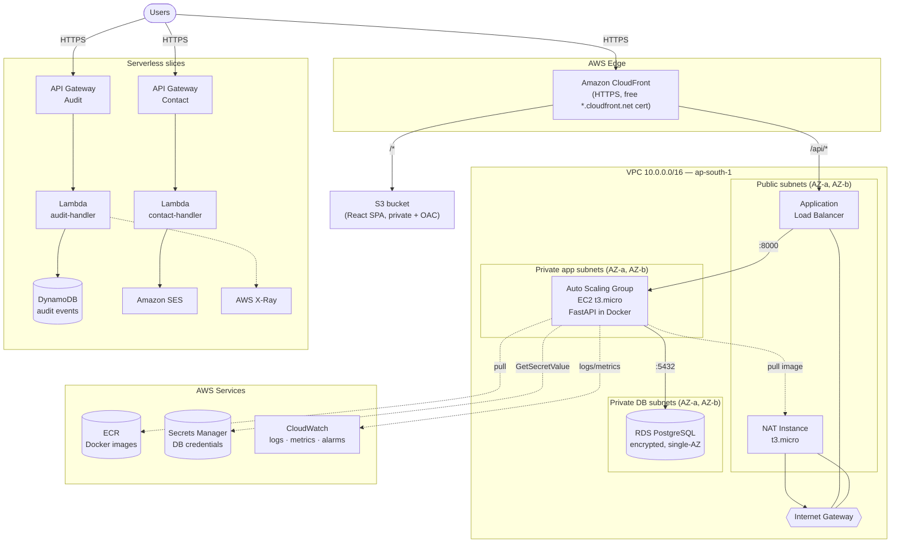
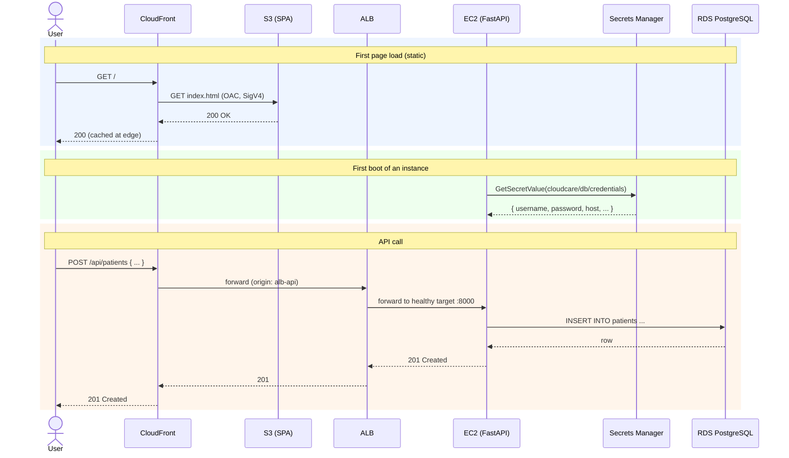
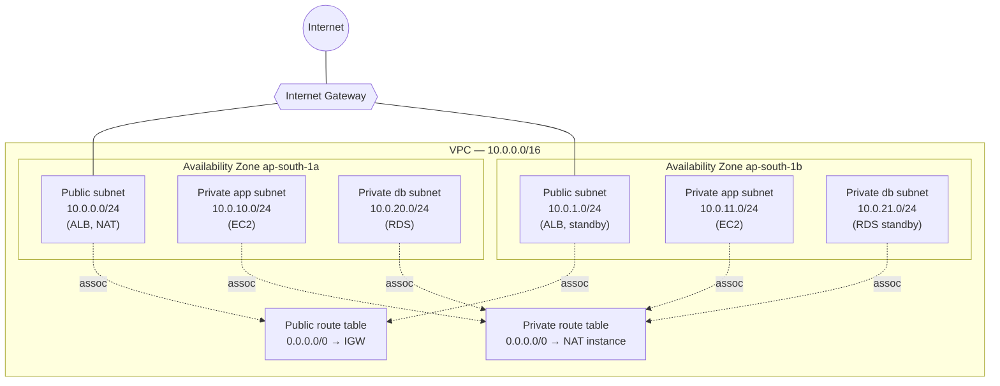
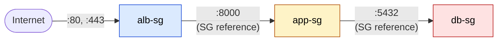
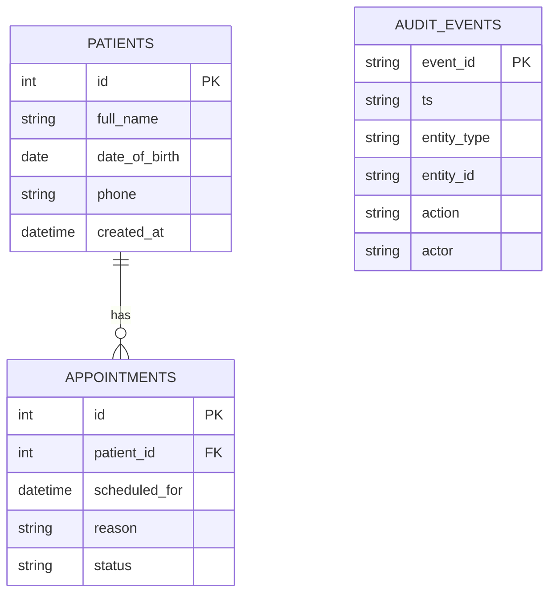
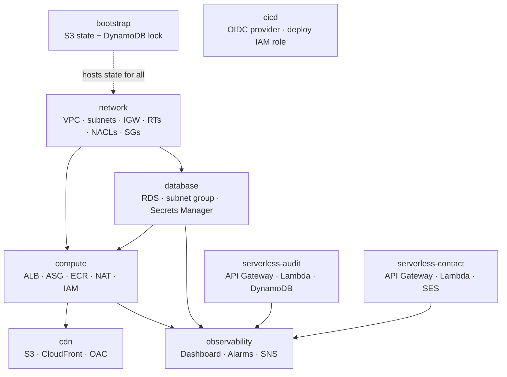
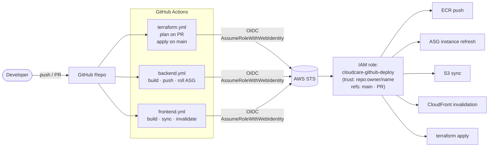

# CloudCare HMS

> A production-style, AWS-native **Hospital Management System** demonstrating the
> AWS Well-Architected Framework. Built entirely in Terraform across nine
> isolated stacks, shipped through GitHub Actions with OIDC federation, and
> designed to live inside the AWS Free Tier.

CloudCare combines a classic **three-tier web application** (React + FastAPI +
PostgreSQL) with two **serverless slices** (an audit log, and a contact form),
fronted by a single CloudFront distribution. Everything is reproducible from
code — `terraform apply` brings the whole stack up; `terraform destroy` returns
you to ~$0.

**Region:** `ap-south-1` (Mumbai) · **IaC:** Terraform 1.5+ ·
**Backend:** Python 3.12 + FastAPI · **Frontend:** React 18 + Vite ·
**Database:** PostgreSQL 16 on RDS · **CI/CD:** GitHub Actions + OIDC

---

## Table of contents

- [Features](#features)
- [Architecture](#architecture)
- [Request flow](#request-flow)
- [Network topology](#network-topology)
- [Security architecture](#security-architecture)
- [Data model](#data-model)
- [Tech stack](#tech-stack)
- [Repository structure](#repository-structure)
- [Infrastructure modules](#infrastructure-modules)
- [Prerequisites](#prerequisites)
- [Quick start — deploy from scratch](#quick-start--deploy-from-scratch)
- [Local development](#local-development)
- [CI/CD pipeline](#cicd-pipeline)
- [Observability](#observability)
- [Cost](#cost)
- [Teardown](#teardown)
- [Documentation & learning path](#documentation--learning-path)

---

## Features

**Application**
- Patients and appointments CRUD with FastAPI + SQLAlchemy
- React SPA (Vite) listing/creating patients and appointments
- `/health` endpoint for load-balancer health checks
- Auto-generated interactive API docs at `/docs`

**Infrastructure**
- Custom VPC (`10.0.0.0/16`) with public/private subnets across two Availability Zones
- Three-tier security-group chain: `ALB → App → DB` (defense-in-depth)
- Stateless NACL backstops on public and private subnets
- Internet egress for private subnets via a free-tier NAT instance (with `source_dest_check=false`)
- Auto Scaling Group of `t3.micro` instances behind an Application Load Balancer
- RDS PostgreSQL (single-AZ, encrypted) with master password generated and stored in **Secrets Manager**
- IAM roles for EC2 with `least-privilege` policies (scoped to specific Secret ARNs)
- Private S3 + CloudFront via **Origin Access Control** (no public S3 URLs)
- One CloudFront URL for the whole app — `/*` → S3, `/api/*` → ALB (no CORS in production)

**Serverless slices**
- API Gateway HTTP API → Lambda → DynamoDB (audit events) with **X-Ray** tracing
- API Gateway HTTP API → Lambda → **SES** (contact form) with `ses:FromAddress` IAM condition

**Operations**
- One CloudWatch dashboard summarising ALB, RDS, and Lambda
- SNS-fanned alarms (ALB 5xx, healthy hosts, RDS CPU/connections/storage, Lambda errors, DynamoDB throttles)
- Cost Explorer + Budgets + Compute Optimizer enabled
- GitHub Actions CI/CD with **OIDC federation** (no AWS keys stored in GitHub)
- Versioned Terraform state in S3 with DynamoDB locking

---

## Architecture

The full system. Public traffic enters through CloudFront; the three-tier path
sits in a VPC; two serverless features hang off API Gateway.



> The data tier is unreachable from anywhere except the app tier: it sits in a
> private subnet, has no public route, and its security group only trusts the
> app security group. Three independent locks.

---

## Request flow

A typical "load the patients page, then add a patient" sequence, with first-time
boot calls included:



---

## Network topology

Six subnets across two AZs, three tiers, two route tables:



| CIDR | Tier | Public? | Purpose |
|------|------|---------|---------|
| `10.0.0.0/24`, `10.0.1.0/24` | Public | ✅ (route → IGW) | ALB, NAT instance |
| `10.0.10.0/24`, `10.0.11.0/24` | App (private) | ❌ (egress via NAT) | EC2 ASG |
| `10.0.20.0/24`, `10.0.21.0/24` | DB (private) | ❌ (local only) | RDS PostgreSQL |

> The DB subnets have **no NAT route either** — the database has zero egress.
> Only the app subnets route through the NAT instance, and only for outbound
> connections initiated from inside.

---

## Security architecture

### Defense in depth — the security-group chain

Each tier accepts traffic **only from the tier directly in front of it**, by
referencing the upstream *security group*, not an IP range:



| SG | Ingress | Source | Egress |
|----|---------|--------|--------|
| `alb-sg` | 80, 443 (TCP) | `0.0.0.0/0` | all |
| `app-sg` | 8000 (TCP) | **`alb-sg`** | all |
| `db-sg`  | 5432 (TCP) | **`app-sg`** | all |

NACLs sit one layer below as stateless subnet guards (allow VPC-internal, allow
ephemeral return ports on public). They're coarse on purpose — the SGs do the
precise work.

### IAM principles applied

- **No long-lived AWS keys in GitHub** — CI authenticates via GitHub OIDC →
  `sts:AssumeRoleWithWebIdentity` → 1-hour creds per job, scoped via the `sub`
  claim to `repo:owner/name:ref:refs/heads/main` and `pull_request`.
- **No credentials on EC2** — instances use an IAM instance profile with
  `secretsmanager:GetSecretValue` scoped to the **exact** DB secret ARN.
- **Contact-form Lambda** cannot impersonate other senders — `ses:SendEmail` is
  conditioned on `ses:FromAddress = <our verified sender>`.
- **CloudFront-only S3 access** — S3 bucket policy allows reads from
  `cloudfront.amazonaws.com` *only when* `aws:SourceArn` matches this
  distribution's ARN.
- **IMDSv2 enforced** on EC2 (`http_tokens = "required"`) to block SSRF-based
  credential theft.

---

## Data model



`PATIENTS` and `APPOINTMENTS` live in **RDS PostgreSQL** (the relational, joined
data). `AUDIT_EVENTS` lives in **DynamoDB** (high-volume, write-heavy, simple
key access) — exactly the split DynamoDB and a relational DB exist for.

---

## Tech stack

| Layer | Choice | Why |
|-------|--------|-----|
| IaC | **Terraform 1.5+** | Declarative, multi-cloud-friendly, the SRE/DevOps standard |
| Backend runtime | **Python 3.12 + FastAPI** | Fast, type-hinted, auto-generates OpenAPI docs, light on `t3.micro` |
| ORM | **SQLAlchemy 2.0** | Mature, type-safe with `Mapped`/`mapped_column` |
| Validation | **Pydantic v2** | Request/response shapes from type hints |
| Frontend | **React 18 + Vite** | Industry-standard SPA toolchain, fast HMR, static build |
| Container | **Docker** | Same image on laptop and EC2; ECR for storage |
| Compute | **EC2 ASG** (3-tier) + **Lambda** (serverless) | Right tool per workload |
| Database | **PostgreSQL on RDS** | Managed backups, encryption at rest, parameter groups |
| NoSQL | **DynamoDB** (on-demand) | Free tier, single-digit-ms reads, serverless-friendly |
| Edge | **CloudFront + S3 (OAC)** | Global HTTPS, edge caching, no CORS, free TLS cert |
| Email | **SES v2** | Pay-per-mail, IAM-controlled sending |
| Tracing | **AWS X-Ray** | Distributed request timelines for the serverless slices |
| Logs/metrics/alarms | **CloudWatch + SNS** | Native AWS observability |
| CI/CD | **GitHub Actions + OIDC** | Keyless, short-lived creds, per-repo trust |

---

## Repository structure

```
cloud-care/
├── README.md                       ← this file
├── docs/                           ← 21 numbered teaching docs (00–20)
│   └── 00-roadmap.md
├── app/
│   ├── backend/                    ← FastAPI + Dockerfile + docker-compose
│   │   ├── app/{main,config,database,models,schemas}.py
│   │   ├── Dockerfile
│   │   ├── docker-compose.yml
│   │   └── requirements.txt
│   └── frontend/                   ← React + Vite
│       ├── src/{main,App,api}.jsx
│       ├── index.html
│       └── package.json
├── terraform/                      ← 9 independent stacks (own state key each)
│   ├── bootstrap/                  ← S3 state bucket + DynamoDB lock table
│   ├── network/                    ← VPC, subnets, IGW, route tables, NACLs, SGs
│   ├── database/                   ← RDS + Secrets Manager
│   ├── compute/                    ← ALB, ASG, ECR, NAT, IAM
│   ├── cdn/                        ← S3 + CloudFront + OAC
│   ├── serverless-audit/           ← API Gateway + Lambda + DynamoDB + X-Ray
│   ├── serverless-contact/         ← API Gateway + Lambda + SES
│   ├── observability/              ← Dashboard + alarms + SNS
│   └── cicd/                       ← GitHub OIDC provider + deploy role
├── .github/workflows/              ← terraform.yml · backend.yml · frontend.yml
└── resourse_images/                ← reference AWS architecture diagrams
```

---

## Infrastructure modules

Each Terraform stack owns its own state key in the shared backend (`s3://
cloudcare-tfstate-<account>/<stack>/terraform.tfstate`). Stacks consume each
other's outputs via `terraform_remote_state`, never by redeclaration.



| Stack | State key | Reads from | Free-tier risk |
|-------|-----------|------------|----------------|
| `bootstrap` | `bootstrap/terraform.tfstate` (local) | — | ✅ ~cents/mo |
| `network` | `network/...` | — | ✅ free |
| `database` | `database/...` | `network` | ⚠️ RDS hours |
| `compute` | `compute/...` | `network`, `database` | ⚠️ ALB + 2× t3.micro hours |
| `cdn` | `cdn/...` | `compute` | ✅ free within tier |
| `serverless-audit` | `serverless/audit/...` | — | ✅ free within tier |
| `serverless-contact` | `serverless/contact/...` | — | ✅ free within tier |
| `observability` | `observability/...` | `compute`, `database`, both serverless | ✅ free within tier |
| `cicd` | `cicd/...` | — | ✅ free |

---

## Prerequisites

- **AWS account** with a non-root IAM admin user, MFA enabled, and budgets configured (see [docs/03](docs/03-aws-account-and-cost-safety.md))
- **AWS CLI v2** authenticated as that admin (`aws sts get-caller-identity` succeeds)
- **Terraform** `>= 1.5`
- **Docker** + **Docker Compose**
- **Node.js** 20+ (for the frontend)
- **Python** 3.12 (for local backend dev, optional — Docker is enough)
- A **GitHub repo** if you want CI/CD (Phase 8)

---

## Quick start — deploy from scratch

The stacks must be applied in dependency order. Each phase has a dedicated doc
with full explanation; below is the minimal command sequence.

### 1. Bootstrap the Terraform state backend

```bash
export AWS_PROFILE=cloudcare
export AWS_REGION=ap-south-1

cd terraform/bootstrap
terraform init
terraform apply -var="state_bucket_name=cloudcare-tfstate-$(aws sts get-caller-identity --query Account --output text)"
```

### 2. Network → Database → Compute

```bash
for stack in network database compute; do
  ( cd "terraform/$stack" && terraform init && terraform apply -auto-approve )
done
```

### 3. Push the backend image to ECR

```bash
REGION=ap-south-1
ACCOUNT=$(aws sts get-caller-identity --query Account --output text)
REPO=$(cd terraform/compute && terraform output -raw ecr_repository_url)

aws ecr get-login-password --region "$REGION" \
  | docker login --username AWS --password-stdin "$ACCOUNT.dkr.ecr.$REGION.amazonaws.com"

( cd app/backend && docker build -t "$REPO:latest" . && docker push "$REPO:latest" )

# Roll the ASG so instances pull the freshly-pushed image:
aws autoscaling start-instance-refresh \
  --auto-scaling-group-name "$(cd terraform/compute && terraform output -raw asg_name)"
```

### 4. CDN → upload the frontend → invalidate

```bash
( cd terraform/cdn && terraform init && terraform apply -auto-approve )

BUCKET=$(cd terraform/cdn && terraform output -raw frontend_bucket)
DIST=$(cd terraform/cdn && terraform output -raw cloudfront_distribution_id)

( cd app/frontend && npm ci && npm run build )
aws s3 sync app/frontend/dist/ "s3://$BUCKET/" --delete
aws cloudfront create-invalidation --distribution-id "$DIST" --paths "/*"
```

### 5. Serverless + observability + CI/CD (optional)

```bash
for stack in serverless-audit serverless-contact observability cicd; do
  ( cd "terraform/$stack" && terraform init && terraform apply )
done
```

### 6. Verify

```bash
CF=$(cd terraform/cdn && terraform output -raw cloudfront_domain_name)
echo "Open https://$CF/  — that's CloudCare."

curl "https://$CF/health"
curl "https://$CF/api/patients"
```

---

## Local development

Run the backend and a throwaway Postgres locally with Docker Compose:

```bash
cd app/backend
docker compose up --build
# API on http://localhost:8000   |  Swagger UI on http://localhost:8000/docs
```

Then run the frontend (Vite dev server, hot reload):

```bash
cd app/frontend
npm install
npm run dev
# Open http://localhost:5173
```

Configure the frontend's API base via an env file:

```bash
# app/frontend/.env.local
VITE_API_URL=http://localhost:8000
```

To point the local frontend at the **deployed** API:

```bash
VITE_API_URL="https://$(cd ../../terraform/cdn && terraform output -raw cloudfront_domain_name)" npm run dev
```

---

## CI/CD pipeline

GitHub Actions authenticates to AWS via OIDC — no long-lived AWS keys are ever
stored in GitHub. Each workflow only runs when files in its scope change.



| Trigger | Workflow | What runs |
|---------|----------|-----------|
| PR touches `terraform/**` | `terraform.yml` | `terraform plan` for every stack |
| Push to `main`, `terraform/**` | `terraform.yml` | `terraform apply` for every stack (dependency-ordered) |
| Push to `main`, `app/backend/**` | `backend.yml` | `docker build/push` + `start-instance-refresh` |
| Push to `main`, `app/frontend/**` | `frontend.yml` | `npm run build` + `s3 sync` + CloudFront invalidate |

---

## Observability

A single CloudWatch dashboard (`cloudcare-overview`) shows ALB traffic & errors,
healthy host count, RDS CPU/connections/storage, and Lambda invocations &
errors — at a glance.

Alarms publish to one SNS topic (`cloudcare-ops-alerts`) which fans out to email
today and can fan out to Slack/PagerDuty later without changing any alarm:

| Alarm | Threshold | Why this threshold |
|-------|-----------|---------------------|
| `cloudcare-alb-5xx` | `≥ 5 5xx in 5 min` | Single error is noise; sustained is signal |
| `cloudcare-alb-no-healthy-hosts` | `< 1 healthy for 2 min` | The site is down — page immediately |
| `cloudcare-rds-cpu-high` | `> 80% avg over 10 min` | Brief spikes are normal; sustained means trouble |
| `cloudcare-rds-storage-low` | `< 2 GB free` | Lead time to expand before writes fail |
| `cloudcare-rds-connections-high` | `> 80 conns avg over 10 min` | `db.t3.micro` caps near 100 |
| `cloudcare-audit-lambda-errors` | `≥ 1 in 5 min` | Lambda errors should be 0 |
| `cloudcare-contact-lambda-errors` | `≥ 1 in 5 min` | Same |
| `cloudcare-ddb-throttled` | `≥ 1 throttle in 5 min` | On-demand shouldn't ever throttle at our scale |

Cost telemetry: **Budgets** (Doc 03) for tripwire alerts, **Cost Explorer** for
attribution by `Project = cloudcare` tag, **Compute Optimizer** for right-sizing
recommendations.

---

## Cost

Designed to live inside the AWS Free Tier when run for ≤ 750 hours/month of
each free-tier-eligible resource. The key habits:

- One `t3.micro` app instance (`desired = 1`); scale to 2 only briefly
- Single-AZ RDS `db.t3.micro` (Multi-AZ written but `false` by default)
- A **NAT instance**, not a NAT Gateway (~$32/mo saved)
- Frontend on CloudFront's always-free tier (1 TB out + 10M HTTPS requests/mo)
- Lambda + DynamoDB + X-Ray always-free quotas dwarf lab usage
- **Destroy after each lab** — only `network/` and `bootstrap/` are left running

> The roadmap doc tracks a four-month part-time learning pace; the only things
> intentionally left running are nearly free. A surprise bill should be
> impossible — Doc 03's budgets, billing alarm, and free-tier alerts all email
> you long before any real spend.

---

## Teardown

Destroy in reverse-dependency order to return to ~$0:

```bash
for stack in observability cdn compute database serverless-contact \
             serverless-audit cicd network; do
  ( cd "terraform/$stack" && terraform destroy -auto-approve )
done
```

Leave `bootstrap/` alone — it holds the state for everything else and costs
cents per month. Bring the whole stack back with one apply loop in
reverse order (see [Quick start](#quick-start--deploy-from-scratch) or
[docs/20](docs/20-teardown-and-interview-story.md) for the complete recipe).

---

## Documentation & learning path

This repository was built incrementally as a complete teaching project for AWS
SRE/DevOps fundamentals. The 21 docs in [`docs/`](docs/) walk through every
phase with the *what*, *why*, and *how* — full Terraform code, design
trade-offs, AWS console verification steps, and interview-relevant framing.

Start at the [**roadmap**](docs/00-roadmap.md) for the full 8-phase plan, or
jump to any phase below:

| Phase | Topic | Docs |
|------:|-------|------|
| 0 | Foundations · account · tooling · Terraform · state backend | [00](docs/00-roadmap.md)–[06](docs/06-remote-state-backend.md) |
| 1 | Networking · VPC · SGs · NACLs | [07](docs/07-networking-vpc-and-subnets.md), [08](docs/08-networking-security-groups-and-nacls.md) |
| 2 | Compute · ASG · ALB | [09](docs/09-compute-launch-template-and-asg.md), [10](docs/10-compute-application-load-balancer.md) |
| 3 | Database · RDS · Secrets Manager | [11](docs/11-database-rds-postgresql.md) |
| 4 | Application · FastAPI · EC2 deploy · React | [12](docs/12-application-fastapi-backend.md), [13](docs/13-application-deploy-to-ec2.md), [14](docs/14-application-react-frontend.md) |
| 5 | Content delivery · S3 · CloudFront | [15](docs/15-content-delivery-s3-cloudfront.md) |
| 6 | Serverless · Lambda · DynamoDB · SES · X-Ray | [16](docs/16-serverless-audit-log-lambda-dynamodb.md), [17](docs/17-serverless-contact-form-lambda-ses.md) |
| 7 | Observability & cost | [18](docs/18-observability-and-cost.md) |
| 8 | CI/CD · teardown · the interview story | [19](docs/19-cicd-github-actions.md), [20](docs/20-teardown-and-interview-story.md) |

---

<sub>Architecture references: AWS Well-Architected Framework · AWS Skill
Builder "Optimizing a cloud architecture" (original diagrams under
`resourse_images/`).</sub>
